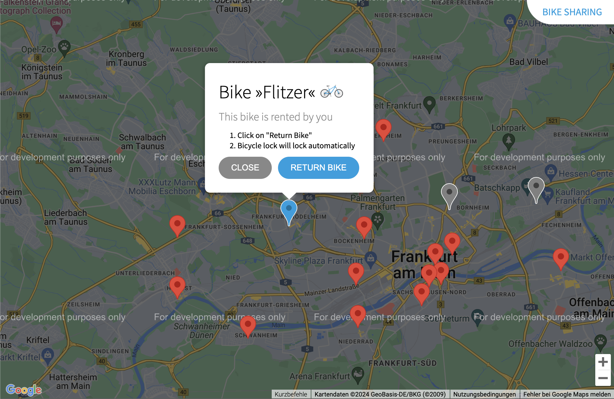

# Web Based Bike Sharing Application

##  Objective

The goal of this project is to develop a web application that displays a Google Map with specified locations of bikes available for sharing. The application will be enhanced in stages to include additional features and ultimately be served through a Golang webserver.

## Stage 1: Basic Google Map with Initial Markers

**Task:**  
Create a static website [./src/ui/index.html](./src/ui/index.html) that displays a Google Map with the provided bike locations [./src/assets/bikes.json](./src/assets/bikes.json).

**Requirements:**

- Use HTML, CSS, and JavaScript.
- Utilize the Google Maps JavaScript API to embed the map.
- Add markers for each location in the provided data set.
- Center the map to a relevant location to display all markers.

**Resources:**

- [MDN Web Docs: HTML](https://developer.mozilla.org/en-US/docs/Web/HTML)
- [MDN Web Docs: CSS](https://developer.mozilla.org/en-US/docs/Web/CSS)
- [MDN Web Docs: JavaScript](https://developer.mozilla.org/en-US/docs/Web/JavaScript)
- [MDN Web Docs: DOM](https://developer.mozilla.org/en-US/docs/Web/API/Document_Object_Model)
- [Google Maps: JavaScript API Overview](https://developers.google.com/maps/documentation/javascript/overview)
- [Google Maps: Markers](https://developers.google.com/maps/documentation/javascript/advanced-markers/overview)

## Stage 2: Adding Additional Markers

**Task:**  
Enhance the application by adding two different types of additional markers.

**Requirements:**

- Define two new types of markers (Marker icons in blue and gray are provided in the assets folder [./src/assets](./src/assets)).
- Update the map to display these different markers for some of the initial bike markers. Some should be gray to show the user that this bike is already rented. One marker should be blue to show that this bike is rented by the user itself.
- Update the code to handle different types of markers appropriately.

**Resources:**

- Continue using the documentation resources listed above.

## Stage 3: Serving the Application via a Go Webserver

**Task:**  
Create a server backend using Go [./src/server/main.go](./src/server/main.go) that serves the frontend application and provides the locations of markers.

**Requirements:**

- Set up a Go webserver to serve the HTML, CSS, JavaScript and icon files.
- Implement an endpoint in Go that returns the marker locations as a JSON response.
- Modify the frontend to fetch the marker locations from the backend instead of using hardcoded data.

**Resources:**

- [Go Documentation](https://go.dev/doc/)
- [Go by Example](https://gobyexample.com/)
- [Go by Example: HTTP Server](https://gobyexample.com/http-server)
- [Go by Example: JSON](https://gobyexample.com/json)
- [MDN Web Docs: JavaScript Fetch](https://developer.mozilla.org/en-US/docs/Web/API/Fetch_API/Using_Fetch)

## Stage 4: Adding Info Windows to Markers

**Task:**  
Enhance the map markers with info windows that display information when clicked.

**Requirements:**

- Implement info windows for each marker.
- Use the provided bike icon [./src/assets/bike.svg](./src/assets/bike.svg) in the info window.
- Ensure that clicking a marker opens an info window with relevant information (e.g., the name of the bike).

**Resources:**

- [Google Maps: Info Windows](https://developers.google.com/maps/documentation/javascript/infowindows)
- Continue using the documentation resources listed above.

## Deliverables:

**Stage 1:**

- A webpage that displays a Google Map with initial bike markers.

**Stage 2:**

- Updated webpage with two additional types of markers.

**Stage 3:**

- A Go webserver serving the frontend application.  
- A Go endpoint providing marker locations as JSON.  
- The frontend application fetching marker locations from the backend.

**Stage 4:**

- Updated map with clickable markers that display info windows.

## Evaluation Criteria:

- **Functionality:** Does the application meet the requirements for each stage?
- **Code Quality:** Is the code well-organized, documented?
- **User Experience:** Is the map interactive and user-friendly?
- **Performance:** Does the application load and run efficiently?

## Notes:

- Regularly commit your code to a version control system (Git).
- Document your code and provide comments where necessary.
- Prepare a short presentation/demo at the end of each stage to show your progress and get feedback.

# 
> **Happy coding!**